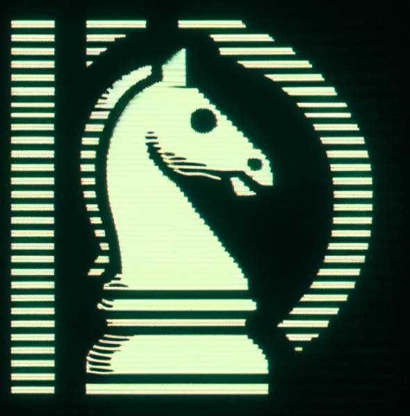

# DChess

_Making chess nerdier_



DChess is a chess engine designed to be:

- a playable chess game
- modular and extensible
- a demonstration of TDD
- lighthearted and fun

# Technical Improvement Roadmap

## High Priority

### Modern C# Features

- **Nullable Reference Types**: Ensure consistent usage throughout the codebase
- **Pattern Matching**: Use more pattern matching in switch expressions
- **File-scoped Namespaces**: Update to C# 10 file-scoped namespaces

### Code Quality and Maintainability

- **Address Uninitialized Fields**: Fix the non-nullable `_lastMoveGameState` field in Game class
- **Complete TODOs**: Optimize `FriendlyPieces` method and `SquaresToCheckForMoveValidMoves`
- **Fix Static/Instance Method Inconsistencies**: Ensure consistent approach to static vs. instance methods

### Algorithm Improvements

- **AI Depth Management**: Implement iterative deepening for better time management
- **Move Ordering**: Add move ordering to improve alpha-beta pruning efficiency
- **Transposition Tables**: Implement caching of previously evaluated positions

## Medium Priority

### Performance Optimizations

- **Board Representation**: Replace array-based board with bitboards for faster move generation and evaluation
- **Move Generation**: Implement targeted move generation instead of checking all squares
- **Position Evaluation**: Enhance evaluation function with piece mobility, pawn structure, and king safety

### Error Handling and Robustness

- **Input Validation**: Add comprehensive validation in the API and UI layers
- **Error Recovery**: Implement mechanisms to recover from invalid states
- **Logging**: Add structured logging for better debugging and monitoring

### Testing Improvements

- **Edge Case Testing**: Add tests for special chess rules (en passant, castling edge cases)
- **Performance Benchmarks**: Add benchmarks to track algorithm efficiency
- **Test Coverage**: Ensure high test coverage across all components

## Lower Priority

### Documentation

- **XML Documentation**: Complete XML documentation for public APIs
- **Algorithm Documentation**: Document the chess AI algorithm in detail
- **Architecture Documentation**: Add high-level documentation explaining the system design

### UI and User Experience

- **Console UI**: Implement a proper chess UI with board visualization
- **API Improvements**: Add more endpoints and better error responses
- **User Feedback**: Add move suggestions and explanations

### Additional Features

- **Opening Book**: Implement an opening book for better early game play
- **Endgame Tablebase**: Integrate endgame tablebases
- **Chess Variants**: Add support for chess variants

# Development Checklist for DCHESS

## Display a Chess Board with Pieces

- [x] Create a `Board` class that holds all pieces and their positions.
- [x] Display the board in the console or graphical UI.
- [x] Populate the board with initial positions for all pieces.

## Move text rendering into a separate class

- [x] Provide interface for rendering the board
    - [x] Takes in a board and returns a string representation of the board
- [x] Adjust the display logic to use the new class

## Refactor the board to be a collection of pieces rather than a 2D array of cells

- [x] Create a `Piece` base abstract class that holds the piece type and colour (eventually it will contain the rules
  and other things specific to that piece).
- [x] Refactor the `Board` class to store pieces and their positions.
- [x] Update the display logic to show pieces on the board.

## Refactor to make use flyweight pattern for pieces

- [x] Create an object pool for pieces that returns objects rather than structs, but still uses structs for the board.
- [x] Refactor the board to use the object pool.

## Allow a piece to be moved

- [x] Add a method on the piece base class to move by square.
- [x] Add a method to check if the move is generally valid.
- [x] Add a virtual method to check if a move for the particular piece type is valid.
- [x] Disallow taking your own pieces.
- [x] ~~Disallow moving off the board. Already handled by square validation~~

## Specific Piece Movement Rules

### Pawn

- [x] Pawns can only move forward.
- [x] Pawns cannot move backwards.
- [x] Pawns can only move forward two squares on their first move and one square otherwise.
- [x] Pawns can take diagonally.

### Knight

- [x] Knights move in an L-shape.
- [x] Knights can ONLY move in an L-shape.
- [x] Knights can jump over other pieces.

### Rook

- [x] Rooks move horizontally or vertically any number of squares.
- [x] Rooks cannot jump over other pieces.

### Bishop

- [x] Bishops move diagonally any number of squares.
- [x] Bishops cannot jump over other pieces.

### Queen

- [x] Queens move horizontally, vertically, or diagonally any number of squares.
- [x] Queens cannot jump over other pieces.

### King

- [x] Kings move one square in any direction.

## Movement Rules phase 2 (requiring piece specific game rules to be implemented)

### Capturing

- [x] Ensure pawns can move diagonally only when capturing an opponent's piece.
- [x] Enforce that pawns can be promoted upon reaching the opposite end of the board.

### Miscellaneous rules

- [x] Implement rules for check (king is under threat).
- [x] Disallow moves that would put the player in check.
- [x] Implement rules for checkmate (king is in check and no legal moves can remove the threat).
- [ ] Castling: The king and rook haven't moved
- [ ] Castling: The squares between a king and rook must be unocupied.
- [ ] En-passant capturing rules.

## Game Status

- [x] Implement a system to keep track of the game status (e.g., ongoing, check, checkmate, stalemate).
- [ ] Store state in a tree structure to allow for undoing moves and exploring possible future moves.
- [ ] Implement a turn system to ensure that players alternate turns correctly.

## Allow the User to Move Pieces Using Algebraic Notation

- [ ] Parse algebraic notation into board squares.
- [ ] Create a function to update the board based on the parsed move.
- [ ] Develop input validation to ensure notation is syntactically correct.

## Game History

- [ ] Implement a way to record the history of moves made during the game. Store each move in a list or file.
- [ ] Provide a command to display the move history (`dc --history`).
- [ ] Consider implementing functionality for undoing and redoing moves based on the game history.

## Error Handling

- [ ] Plan for robust error handling, especially for user input. This includes providing useful error messages when
  illegal moves are attempted.
- [ ] Ensure that the error messages are clear and helpful, guiding the user on how to correct their input or explaining
  why a move cannot be made.

## REST API

### Design

- The API will call the Core library and essentially just be a plugin.
- The game should be fully playable via API calls.
- The code will run on an Azure Function.
- No game state will be stored on the server, but the server will be able to compute the next move based on current game
  state passed in the request.
- Rate limiting will be implemented to prevent abuse.
- Powershell and bash scripts will be provided to allow the game to be played from the command line without using the
  API directly.
  The API will have the following endpoints:

### Endpoints

#### GET /

- This endpoint returns a welcome message along with helpful information on how to use the API.
- Example response:

```
Welcome to DChess API!
- To get started with a new game, use call the /new endpoint.
```

#### GET /new

Returns a new game state with the initial board setup a link to the game state.

#### GET /game?bitboard={`bitboards`}&name={`name`}&colour={`black`|`white`}&turn={`black`|`white`}&level={
`level`}&render={`true`|`false`}&move={`move`}

This endpoint returns a board with a given game state.

- `bitboard`: A string representation of the bitboards in hexadecimal.
- `name`: The current player's name.
- `colour`: The current player's colour, either `black` or `white`.
- `turn`: The current turn.
- `level` (optional - defaults to 1): The difficulty level of the AI player.
- `render` (optional defaults to `true`): If `true`, the board will be rendered as a string. If `false`, the bitboards
  will be returned.
- `move` (optional): The move to be made by the player. If the move is valid, the board will be updated with the new
  move and the AI will make its move. `move` can be specified as a string in algebraic notation (
  see https://en.wikipedia.org/wiki/Algebraic_notation_(chess)) or as a pair of squares e.g. `e2e4`.

# Optimisation

- [ ] Use bitboards to represent the board state
- [x] Use the flyweight pattern to reduce memory usage
